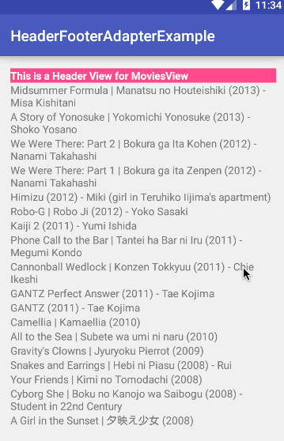

# Simple HeaderFooterAdapter for RecyclerView.

[](https://circleci.com/gh/hisaichi5518/header-footer-adapter)

Add header/footer view to a RecyclerView.

## Screenshot



# Synopsis

```java
// Create a Adapter with HeaderFooterAdapter.
class MovieAdapter extends HeaderFooterAdapter<ItemViewHolder> {
    private List<String> movies;
    private LayoutInflater layoutInflater;

    MovieAdapter(LayoutInflater layoutInflater) {
        this.layoutInflater = layoutInflater;
    }

    void setMovies(List<String> movies) {
        this.movies = movies;
        notifyDataSetChanged();
    }

    @Override
    protected ItemViewHolder onCreateItemViewHolder(ViewGroup parent, int viewType) {
        return new ItemViewHolder(
                this.layoutInflater.inflate(R.layout.row_movie, parent, false));
    }

    @Override
    protected void onBindItemViewHolder(ItemViewHolder holder, int position) {
        holder.setName(this.movies.get(position));
    }

    @Override
    protected int getAdapterItemCount() {
        return movies.size();
    }
}


// Add a Header/Footer view to created Adapter at your Activity/CustomView/Fragment
MovieAdapter adapter = new MovieAdapter(layoutInflater);
adapter.setHeaderView(headerView);
adapter.setFooterView(footerView);
recyclerview.setAdapter(adapter);
```

see [example application directory](https://github.com/hisaichi5518/android-HeaderFooterAdapter.java/tree/master/example), if you want to get more sample code.

# Install

## Add it in your root build.gradle at the end of repositories

```
allprojects {
    repositories {
        ...
        maven { url "https://jitpack.io" }
    }
}
```

## Add the dependency

```
dependencies {
    compile 'com.github.hisaichi5518:header-footer-adapter:v0.0.1'
}
```

## License

```
The MIT License (MIT)

Copyright (c) 2016 hisaichi5518

Permission is hereby granted, free of charge, to any person obtaining a copy
of this software and associated documentation files (the "Software"), to deal
in the Software without restriction, including without limitation the rights
to use, copy, modify, merge, publish, distribute, sublicense, and/or sell
copies of the Software, and to permit persons to whom the Software is
furnished to do so, subject to the following conditions:

The above copyright notice and this permission notice shall be included in all
copies or substantial portions of the Software.

THE SOFTWARE IS PROVIDED "AS IS", WITHOUT WARRANTY OF ANY KIND, EXPRESS OR
IMPLIED, INCLUDING BUT NOT LIMITED TO THE WARRANTIES OF MERCHANTABILITY,
FITNESS FOR A PARTICULAR PURPOSE AND NONINFRINGEMENT. IN NO EVENT SHALL THE
AUTHORS OR COPYRIGHT HOLDERS BE LIABLE FOR ANY CLAIM, DAMAGES OR OTHER
LIABILITY, WHETHER IN AN ACTION OF CONTRACT, TORT OR OTHERWISE, ARISING FROM,
OUT OF OR IN CONNECTION WITH THE SOFTWARE OR THE USE OR OTHER DEALINGS IN THE
SOFTWARE.
```
